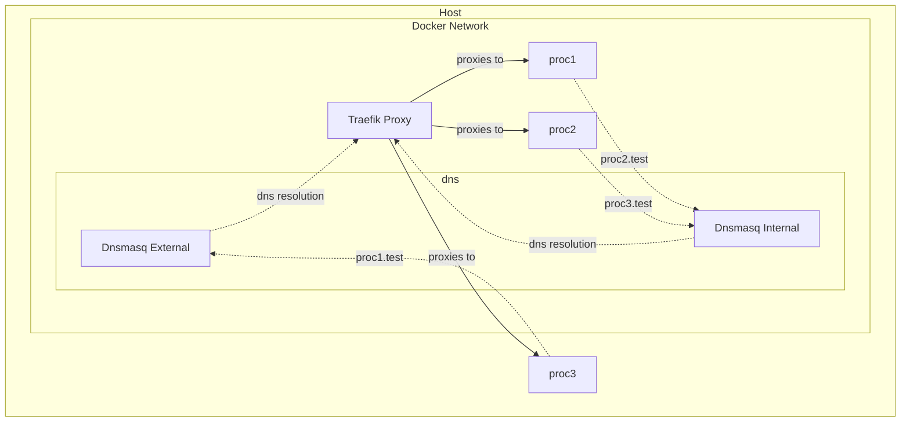

# KL Network Topology

We make use of three main networking components:

+ A Traefik Proxy docker container (Bound to :80) configured to proxy `.test` subdomains to either containers or processes on the host machine
+ A dnsmasq container which handles DNS from the host machine (Bound to :53) and resolves to `127.0.0.1`
+ A dnsmasq container which handles DNS requests from docker containers and resolves to the Traefik proxy

All three components are running inside a Docker network and have predefined, static IP addresses. It's necessary to have two separate dnsmasq containers as the proxy is identified differently from the host vs from inside the docker network. The host machine will need to be configured to use `127.0.0.1` to resolve `.test` domains. See the [Initial Setup](../README.md#initial-setup) section for more information on how to configure this.

Which this topology, the following properties are observed:

+ All `*.test` DNS requests made from the host machine are routed to `127.0.0.1`
+ All `*.test` DNS requests made from within the docker network are routed to `172.5.0.101` which is the IP address of the proxy inside the network

> Note: All docker containers that need to be able to resolve `.test` domains must have their DNS server (use the flag `--dns`) set to the IP of the internal dnsmasq container



## IPs

+ Internal DNSMasQ - `172.5.0.100`
+ Proxy IP - `172.5.0.101`

## Proxy Configuration

The Traefik Proxy is started with the `file` provider and is configured to watch the mounted directory `~/.config/kl/proxy` which can be used by users and tools to configure arbitrary proxy endpoints. It is recommended to read up on [Traefik Proxy](https://doc.traefik.io/traefik/) to get an overall understanding of how the proxy works and how to configure it.


An example proxy configuration would look as follows

```yaml
# ~/.config/kl/proxy/example.yml
http:
  routers:
    test:
      rule: Host(`example.test`)
      service: example

  services:
    example:
      loadBalancer:
        servers:
        - url: http://host.docker.internal:8080
```

Substituting all occurrences of `example` with the service name (i.e. `example`) and `8080` with whatever port the process is bound to on your host.

> Note that because the Traefik proxy is running in the docker network you need to refer to your host machine as `host.docker.internal` instead of the normal `localhost` or `127.0.0.1`.

Traefik will automatically detect the file change and reconfigure itself.

You can access `http://proxy.test` to see all configured routing rules.

---

It is recommended to use [modules](../README.md#modules) and the networking components exposed there instead of manually writing proxy configurations.
